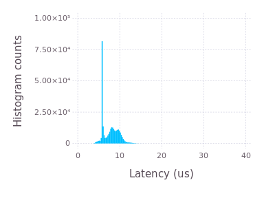

# POSIXClock.jl
Julia bindings for POSIX Clock.

# Installation
From Julia REPL, run

    Pkg.clone("https://github.com/ibadr/POSIXClock.jl")

# Scope
The initial scope of this Julia package is to expose PREEMPT\_RT capabilities to Julia users. The long-term goal is to provide cross-platform wrapping of POSIX clock_*() functions similar to [node-posix-clock](https://github.com/avz/node-posix-clock) and [posix-timer](https://hackage.haskell.org/package/posix-timer).

# Usage
For real-time performance, it is recommended to use in-place operations and to pre-allocate all needed variables prior to entering the real-time section. Also, use CLOCK_MONOTONIC in order to avoid jumps related to changing the system time. Typical usage example is as follows

```
import POSIXClock; CLK=POSIXClock

function main() # it is important to wrap your code in a function to avoid
    # unnecessary memory allocations
  t=CLK.timespec(0,0) # pre-allocate
  gc_enable(false) # temporarily disable the GC
  # enter real-time section
  CLK.gettime!(t,CLK.CLOCK_MONOTONIC) # get current Linux time
  @time for n in 1:10000
    CLK.nanosleep!(t,300000) # increment t by 300us and sleep until that time (absolute time)
  end # the loop time should be around 3 sec
  # exit real-time section
  gc_enable(true) # enable the GC
end

main() # execute the main function
```

# Examples
See the examples directory. The next example latency plot was obtained by running Julia as a real-time process on PREEMPT_RT Linux kernel, then including the "rt_histogram.jl" file from the examples folder. This example plot was generated on Ubuntu 16.04 running a custrom PREEMPT_RT Linux kernel v4.4.12-rt19 with CPU frequency scaling disabled. Julia was run on a dedicated processor core (using [<tt>taskset</tt>](http://linux.die.net/man/1/taskset) \& <tt>isolcpus=1</tt> kernel command line) on a dual-core Intel Celeron processor based on SandyBridge architecture, with elevated SCHED\_FIFO priority 50 (using [<tt>chrt</tt>](http://linux.die.net/man/1/chrt)). The first CPU core was stress-loaded using the [<tt>stress</tt>](http://linux.die.net/man/1/stress) utility.


