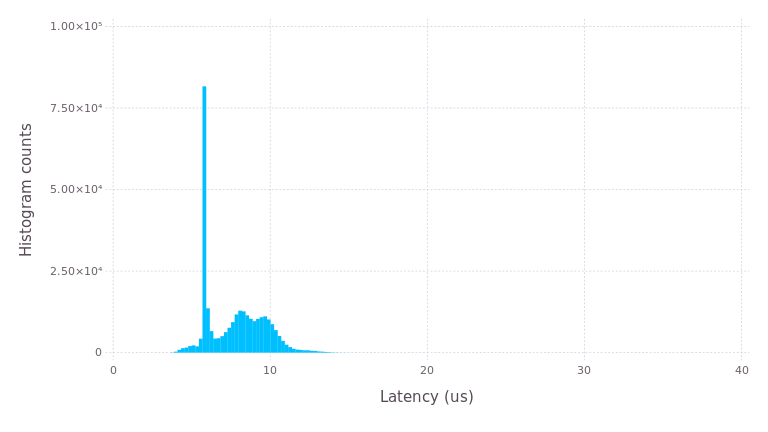

# POSIXClock.jl
Julia bindings for POSIX Clock.

# Scope
The initial scope of this Julia package is to expose PREEMPT\_RT capabilities to Julia users. The long-term goal is to provide cross-platform wrapping of POSIX clock_*() functions similar to [node-posix-clock](https://github.com/avz/node-posix-clock) and [posix-timer](https://hackage.haskell.org/package/posix-timer).

# Examples
See the examples directory. The next example latency plot was obtained by running Julia as a real-time process on PREEMPT_RT Linux kernel, then including the "rt_histogram.jl" file from the examples folder. This example plot was generated on Ubuntu 16.04 running a custrom PREEMPT_RT Linux kernel v4.4.12-rt19 with CPU frequency scaling disabled. Julia was run on a dedicated processor core (using [<tt>taskset</tt>](http://linux.die.net/man/1/taskset) \& <tt>isolcpus=1</tt> kernel command line) on a dual-core Intel Celeron processor based on SandyBridge architecture, with elevated SCHED\_FIFO priority 50 (using [<tt>chrt</tt>](http://linux.die.net/man/1/chrt)). The first CPU core was stress-loaded using the [<tt>stress</tt>](http://linux.die.net/man/1/stress) utility.

